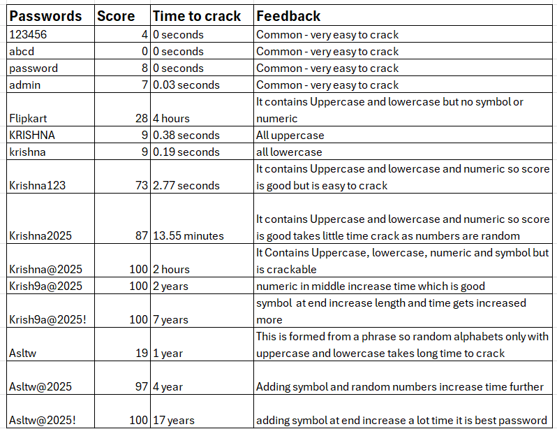

# Internship-Elevatelabs-task6

## Task 6 : Create a Strong Password and Evaluate Its Strength.

### Objective: 

Understand what makes a password strong and test it against password strength tools.

### Tools: 

Online free password strength checkers (e.g., passwordmeter.com).

### Deliverables:  

Report showing password strength results and explanation

### Solution:

Created multiple passwords with varying complexity (simple, mixed case, with numbers, with symbols, and based on a phrase).

[Tested Password list](Passwordlist.txt)

Tested each password using https://www.passwordmonster.com and https://passwordmeter.com password strength checkers.

Recorded the score, estimated time to crack, and feedback.

